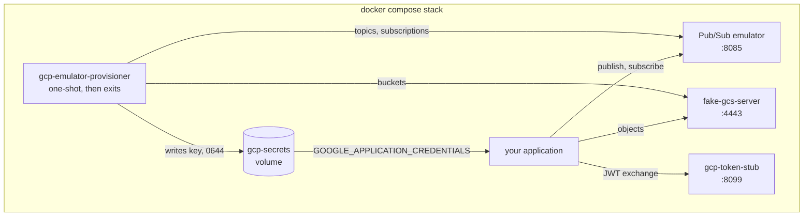
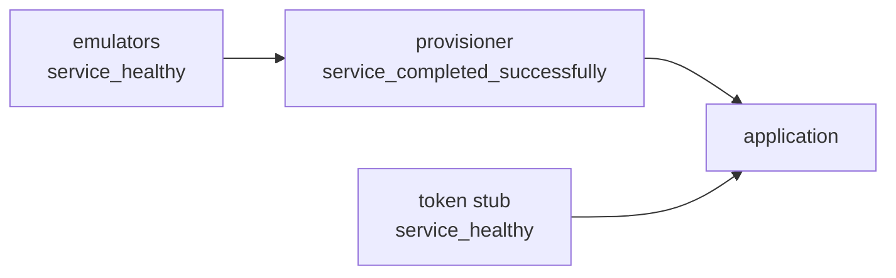
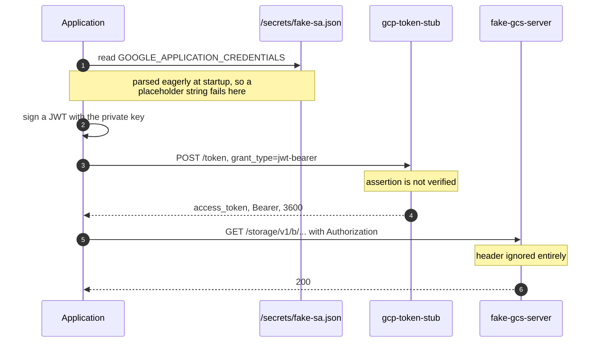
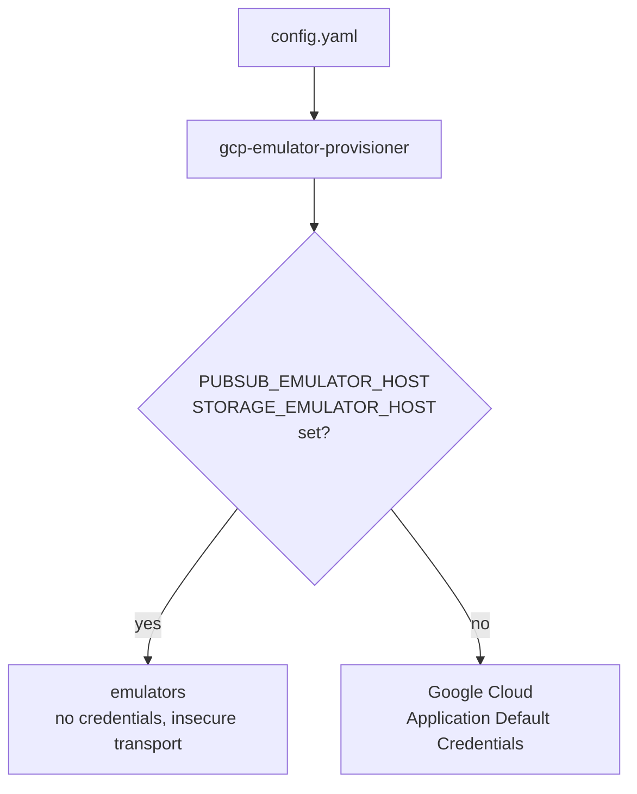
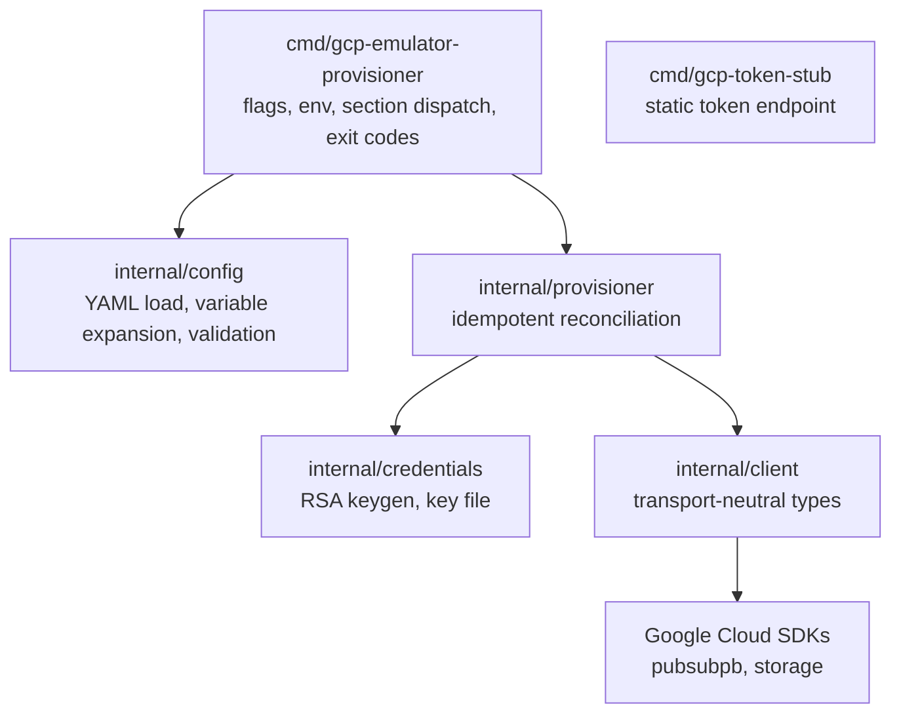
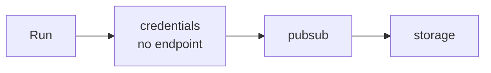
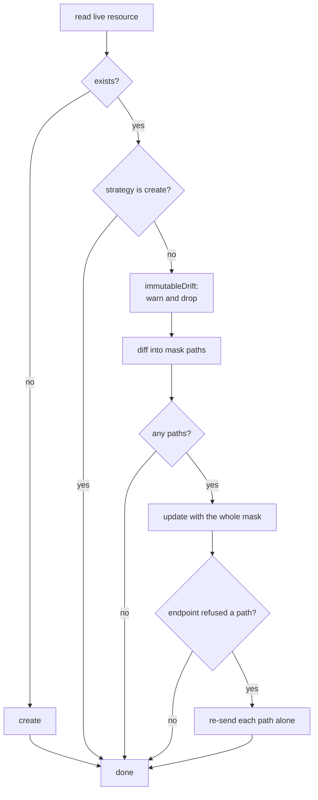

# Architecture

How the pieces fit together, and why the awkward parts are the way they are.
[CLAUDE.md](../CLAUDE.md) covers the constraints that are easy to break when
changing the code; this covers the shape.

## The local stack

Five containers, of which only one is long-lived on our side.

Note what has no outgoing arrows: **the token stub only ever receives.** It
reads no files, holds no state and makes no calls of its own, which is why it
does not mount the secrets volume — it never needs the key it hands out tokens
for. Its entire input is a listen address, a token string and a lifetime.

Startup order is a chain of two conditions:

The provisioner does not depend on the stub. It talks to the emulators with
authentication disabled outright, so it never mints a token.

## Why a fake key and a token stub exist at all

An emulator ignores authentication. Some client libraries do not, and the two
failures happen at different moments.

Steps 1 to 3 are why the key must be a real RSA keypair rather than a
placeholder: Spring Cloud GCP calls `GoogleCredentials.fromStream` at startup and
parses the private key there and then. Steps 4 to 6 are why the stub must exist:
`google-cloud-storage` for Java has no `STORAGE_EMULATOR_HOST` equivalent, so a
JVM application reaches the emulator through `spring.cloud.gcp.storage.host`
while still holding real `ServiceAccountCredentials`, and will not issue a
request until it has obtained a token.

Nothing verifies anything in this picture. The stub does not check the JWT, and
fake-gcs-server does not check the Bearer token or any signed URL. Verifying in
the stub would be theatre, so it does not.

The key is generated locally, so Google holds no matching public key and the
file cannot authenticate to Google Cloud — the credential equivalent of a
self-signed certificate for localhost.

## One binary targets two very different endpoints

That switch belongs to the Google client libraries, not to us. The rule that
follows from it: **nothing is supported that only works against one side**, so a
config exercised locally is the one that ships. Where an endpoint genuinely
cannot do something, the difference is reported rather than designed around.

## Package layering

`cmd/gcp-token-stub` stands alone: it imports nothing from `internal`, which is
what lets it ship as a 6MB `scratch` image.

The layer that matters is `internal/client`. It exposes plain structs and
converts to and from protobuf internally, so the diff logic and the
immutable-field rules are unit-testable without a live endpoint or a protobuf
fixture. **`pubsubpb` must not appear in `internal/provisioner`.**

Short ids in, short ids out: config and the provisioner deal in `orders`, and
only the client expands to `projects/{p}/topics/orders`.

## Sections

Three, dispatched by `--section`. They are independent, not phases.

Credentials come first in a full run because the applications that need the key
usually start alongside the provisioner. It touches no endpoint, so
`--section=credentials` works with nothing else running.

Ordering *within* the Pub/Sub section is load-bearing: every topic is created
before any subscription, because a subscription naming a topic that does not
exist yet — its own, or its dead letter target — fails with `NotFound`, and dead
letter targets are routinely declared after the subscription that uses them.

## Reconciling one resource

Additive and subset-based. Only fields the config actually sets are compared, so
an omitted value means "leave it alone" rather than "reset it".

Nothing absent from the config is ever deleted.

## Two ways a difference is tolerated

Both end in a warning rather than a failed run, and they are easy to conflate.

| | Immutable fields | Endpoint gaps |
|---|---|---|
| Detected | before the call, by `immutableDrift` | after the call, by `IsUnsupportedField` |
| Examples | `filter`, `enable_message_ordering`, a subscription's topic | `labels`, `expiration_policy` in an update mask |
| Why | applying them would mean recreating the resource and discarding its backlog | the emulator does not model the field, though Google Cloud does |
| Result | reported, never entered into the mask | reported, and the other paths still applied |

The second one has a sharp edge. The emulator validates the **whole** mask
before touching anything, so a single refused path used to abandon every change
batched with it while the run still reported success. Hence the retry: send the
batch, and if it is refused, send each path on its own.

## Things that deliberately do not exist

| | Why |
|---|---|
| IAM | neither emulator enforces it, so a config exercising it locally would diverge silently from production. That layer belongs in Terraform |
| Pub/Sub schemas, BigQuery / GCS / Bigtable export subscriptions | the emulator implements none of them, and serves no `SchemaService` at all |
| Bucket labels, lifecycle rules, CORS | fake-gcs-server accepts them and silently discards them, so every run would see drift and rewrite forever without converging |
| Signature verification in the token stub | nothing downstream verifies signatures either |
| Deletion of anything | the provisioner is additive by design |

The common thread: a feature that cannot converge, or that behaves differently
on the two targets, is left out rather than half-supported.
